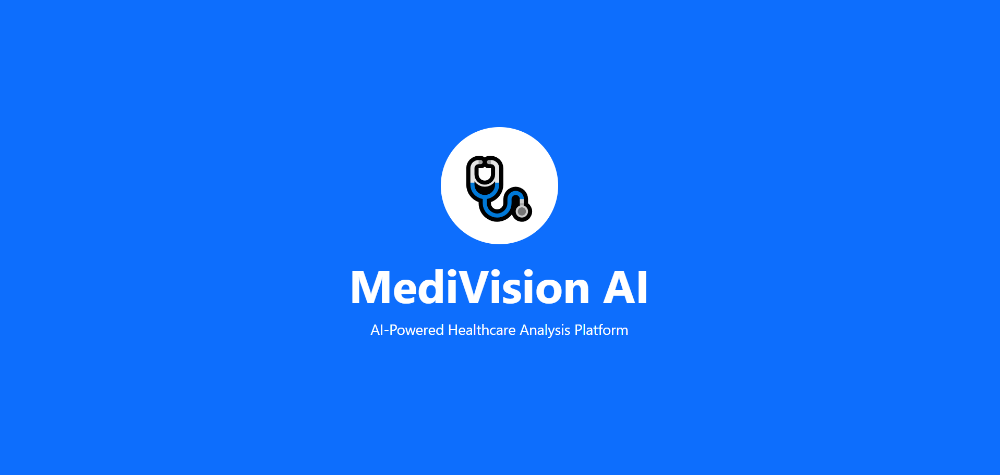
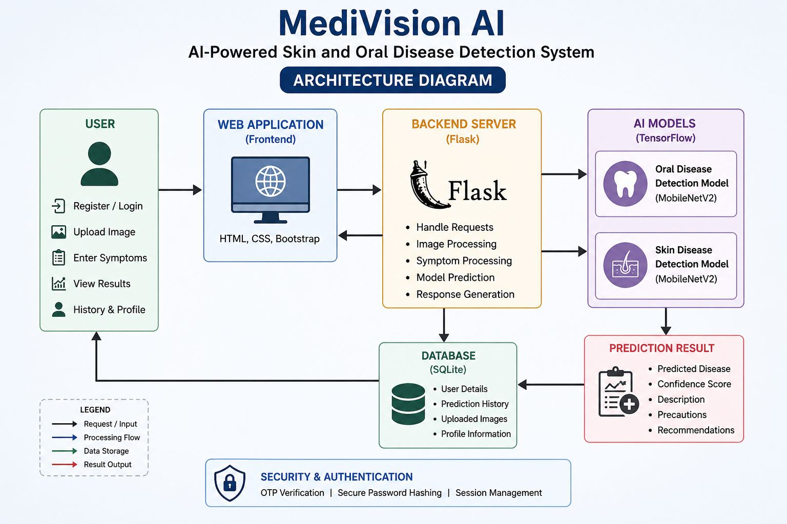
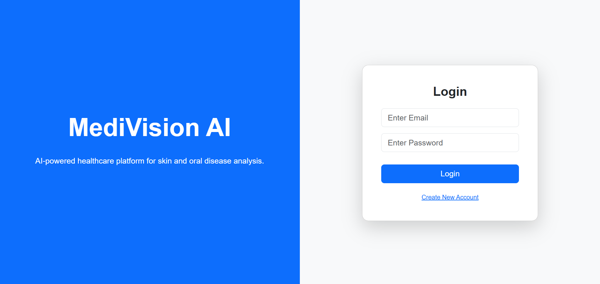
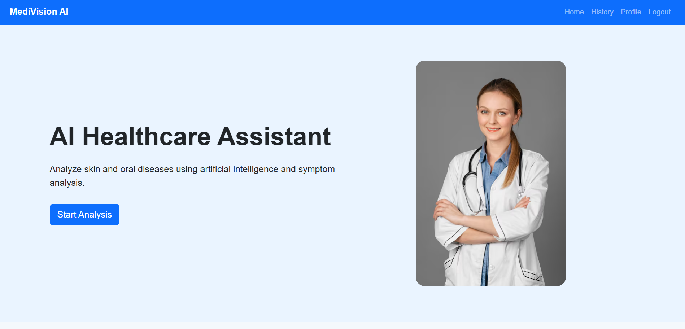
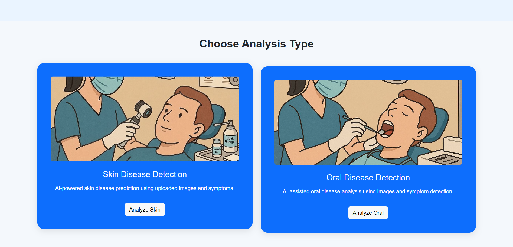
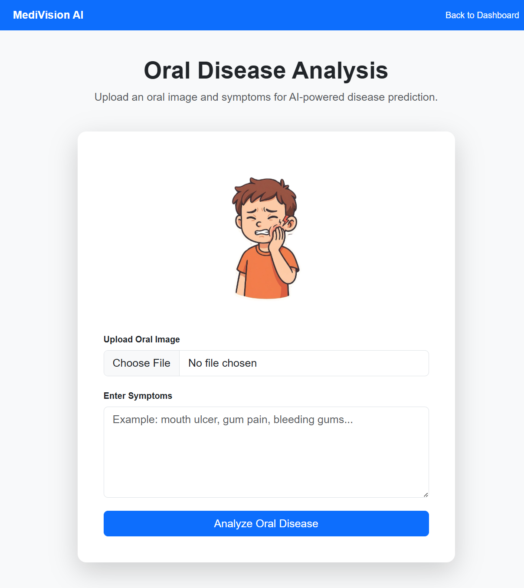
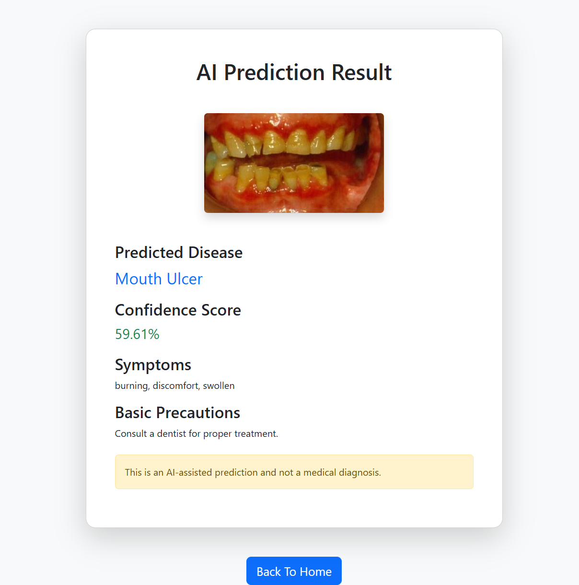
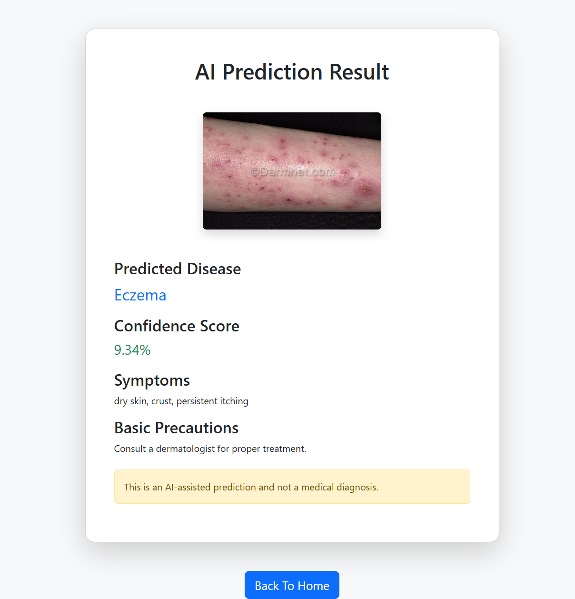
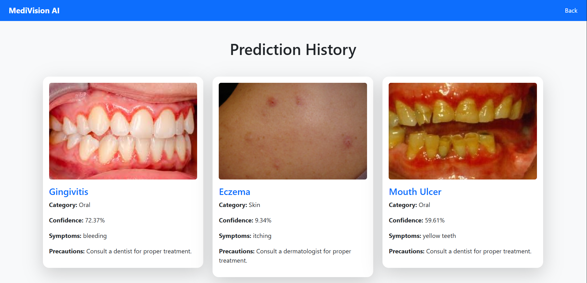
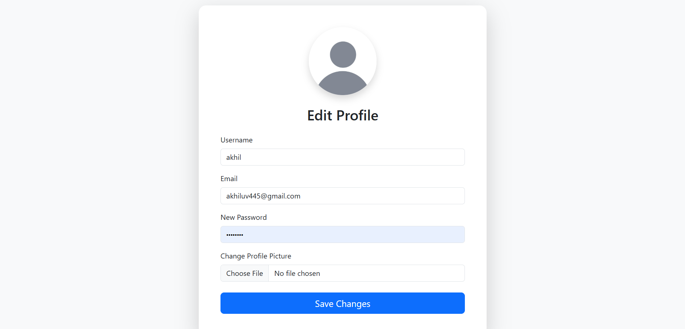

# MediVision AI

## Overview

MediVision AI is an AI-powered healthcare web application developed using Flask and TensorFlow for intelligent skin and oral disease detection using image analysis and symptom-based prediction.

The system allows users to:
- Upload skin or oral images
- Enter symptoms
- Get AI-based disease predictions
- View prediction confidence
- Track prediction history
- Manage user profile securely

---

# Features

- Skin Disease Detection
- Oral Disease Detection
- Symptom-Based Analysis
- OTP Email Verification
- User Authentication System
- Prediction History Tracking
- Profile Management
- AI Confidence Score Display
- Responsive UI Design

---

# Technologies Used

| Technology | Purpose |
|---|---|
| Python | Core Programming |
| Flask | Backend Framework |
| TensorFlow | AI/Deep Learning |
| SQLite | Database |
| HTML/CSS | Frontend |
| Bootstrap | UI Design |
| MobileNetV2 | Transfer Learning Model |

---

# Datasets Used

## Skin Disease Dataset

Source: Kaggle

https://www.kaggle.com/datasets/pacificrm/skindiseasedataset

---

## Oral Disease Dataset

Source: Kaggle

https://www.kaggle.com/datasets/salmansajid05/oral-diseases

---

# Project Structure

MediVision-AI/

├── app.py

├── requirements.txt

├── README.md

├── LICENSE

├── models/

├── templates/

├── static/

├── screenshots/

└── docs/

---

# Installation

git clone https://github.com/yourusername/MediVision-AI.git

cd MediVision-AI

pip install -r requirements.txt

python app.py

---

# Architecture Diagram

# Screenshots

## Login Page

## Dashboard Page

## Analysis Section

## Oral Analysis Page

## Oral Analysis Result

## Skin Analysis Page

## Skin Analysis Result

## History Page

## Profile Page

# AI Model Information

## Oral Disease Model

- TensorFlow CNN-based classification model
- Integrated with symptom analysis
- Detects oral diseases from uploaded images

### Oral Disease Accuracy

48.15%

---

## Skin Disease Model

- MobileNetV2 Transfer Learning Model
- Multi-class skin disease classification

### Skin Disease Accuracy

23.60%

---

# Future Enhancements

- Improve AI model accuracy
- Real-time camera prediction
- Doctor consultation integration
- AI chatbot support
- Cloud deployment
- PDF medical reports

---

# Disclaimer

This project provides AI-assisted predictions and should not replace professional medical diagnosis.

---

# Author

Developed by Akhil Mohan